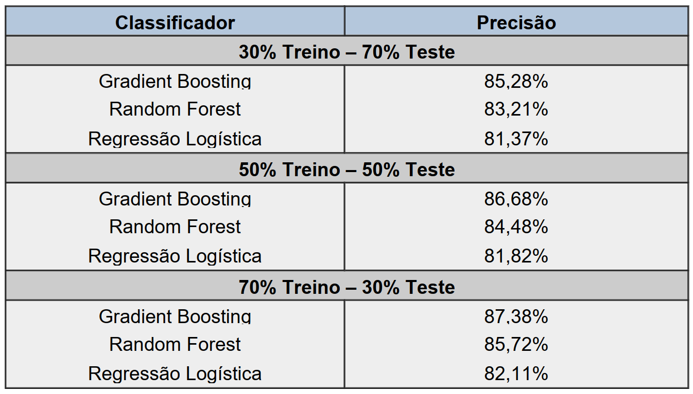

# IC_2018-19 - Inteligência Artifical e Aplicações

Iniciação Científica realizada durante 1 ano a partir do segundo semestre de 2018.
Orientador: Prof. Dr. Felipe Fernandes Fanchini

# Objetivos

O projeto visa gerar, modelar e analisar um banco de dados mySQL de uma empresa de TELECOM e por meio de diversas técnicas de classificação e rede neural analisar os usuários e, de acordo com suas últimas ações, classificar se estes são usuários com número ainda ativo no sistema ou se foram cancelados pelo menor que seja o motivo e também analisar a eficiência de cada característica dentro dos diversos métodos de classificação. Para tal foram utilizados os programas computacionais MatLab e Python, além de Banco de dados Mysql para o armazenamento, modelação e organização dos dados pré disponibilizados.

## Objetivos específicos:

1 - Gerar um banco de dados no qual serão armazenados milhares de dados divididos em diferentes tabelas, cada uma com seus próprios atributos e tipos de informação;

2 - Modelar e organizar o banco de dados de acordo com as necessidades do projeto, por meio da separação dos contratos de cada usuário e também a contagem do número de ação destes dentro de um período de tempo pré-estabelecido;

3 - Gerar, após toda a seleção e modelagem das informações necessárias, arquivos CSV já organizados com os atributos que serão analisados pelas diferentes ferramentas de classificação de dados;

4 - Pesquisar e criar um script básico de cada método de classificação de dados para ser aplicado dentro do dataset criado a partir do arquivo CSV já existente, para assim classificar os contratos dos usuários do TELECOM como sendo ativos ou cancelados, com diferentes precisões de acordo com o número e ordem nas características analisadas.

5 - Reconhecer a importância de cada atributo fornecido para o aumento ou diminuição da precisão e velocidade dos classificadores e comparar a eficácia dos diferentes métodos de classificação sobre os dados modelados e fornecidos ao programa para treino e teste.

## Etapas de Desenvolvimento

**1 - Implementação do Banco de Dados**
	Para mensurar o índice de evasão foi desenvolvido um banco de dados com o histórico de transações dos clientes da companhia e implementado diferentes algoritmos de IA para prever a taxa de cancelamento dos mesmos na rede de Telecom

**2 - Modelagem dos Dados**

Para armazenamento e modelação dos dados da companhia de telecom, foi utilizado um banco de dados MySQL.

Após a indexação dos números de contrato de cada cliente da companhia, os dados foram separados de acordo com as ações de cada usuário. Assim, a frequência acumulada do número de ações de cada tipo (taxa de recarga, uso de dados móveis, ligações efetuadas, etc) foi separada semanalmente no prazo de um mês, resultando em 16 características nas quais os classificadores em linguagem Python foram implementados.

**3 - Programação**
Utilizando-se da biblioteca de Aprendizado de Máquina Scikit-Learn foi desenvolvido um programa em linguagem Python que recebia os dados já modelados e por meio de um script genérico para os diferentes classificadores, realizava as fases de treino e de teste e por fim classificava cada usuário como ATIVO ou CANCELADO e exibia a probabilidade de um usuário específico, no prazo de um mês, de cancelar sua linha.

# Classificadores observados

Durante o desenvolvimento do projeto foi pesquisado o funcionamento e aplicação básica de cada um dos 10 algoritmos de classificação, dentre eles:

- Gradient Boosting
- Random Forest
- Regressão Logística
- K-Nearest Neighbor

# Precisão de alguns dos classificadores observados:

# Arquivos

Neste repositório estão contidos alguns dos programas desenvolvidos durante a realização do projeto, os resultados obtidos e também a documentação feita para esta Iniciação Científica.

Dentro da pasta TELECOM estão contidos alguns dos programas desenvolvidos e dentro de Caracteristicas e CaracteristicasT, estão todas as 16 características obtidas através da modelação do banco de dados que serão utilizadas durante a classificação.
